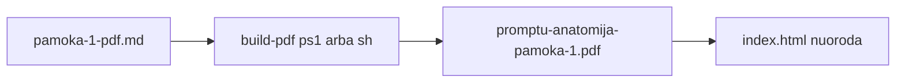
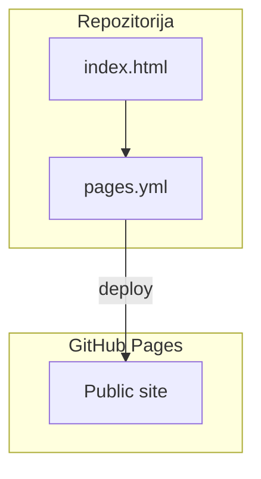
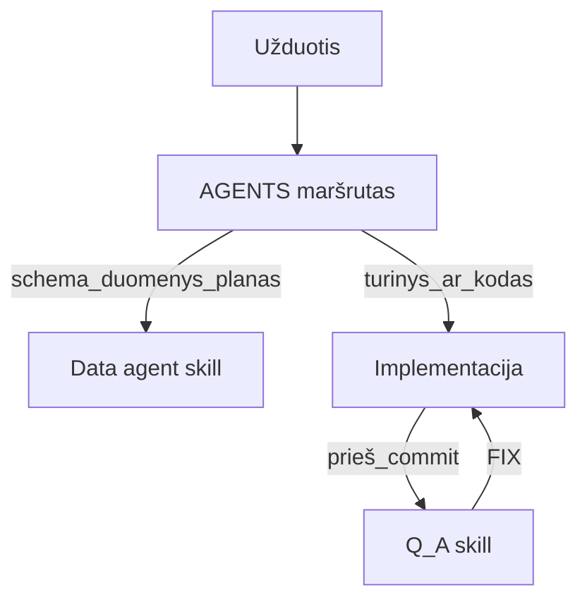

# Mermaid pavyzdžiai — Data agentas

Šablonus galima kopijuoti ir adaptuoti `SKILL.md` kontekste. Laikytis taisyklių iš pagrindinio skilo (node ID be tarpų, `subgraph id [Label]`, kabučių etiketės ant rodyčių).

## 1. Lean turinio srautas (MD → PDF → puslapis)

## 2. Sluoksniai: statinis deploy (GitHub Pages)

## 3. Orkestratoriaus logika (supaprastinta)

