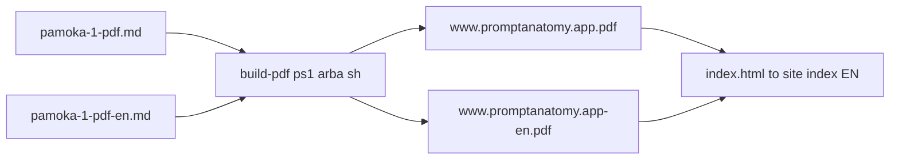
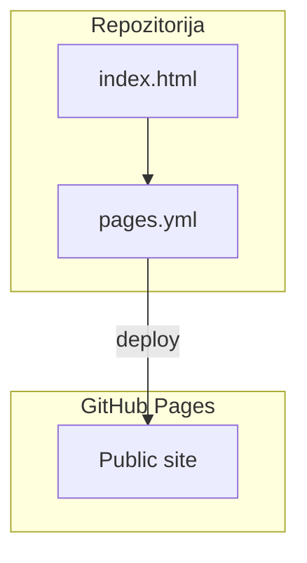
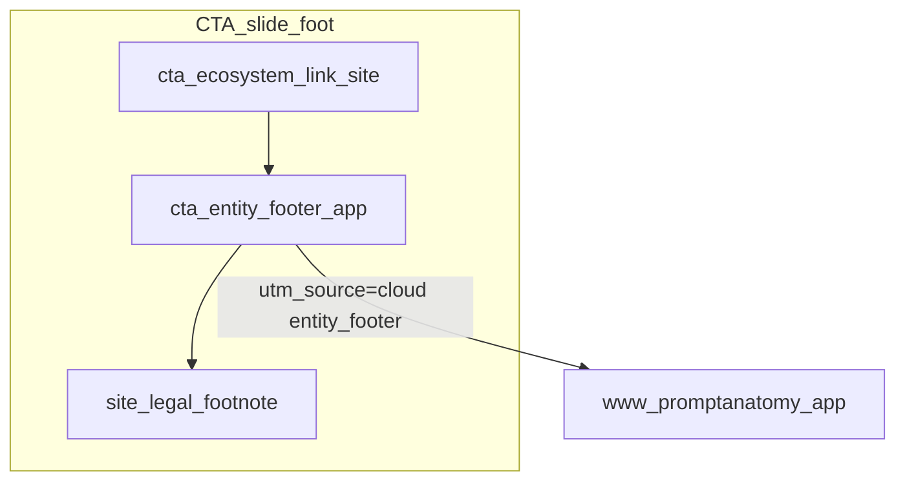
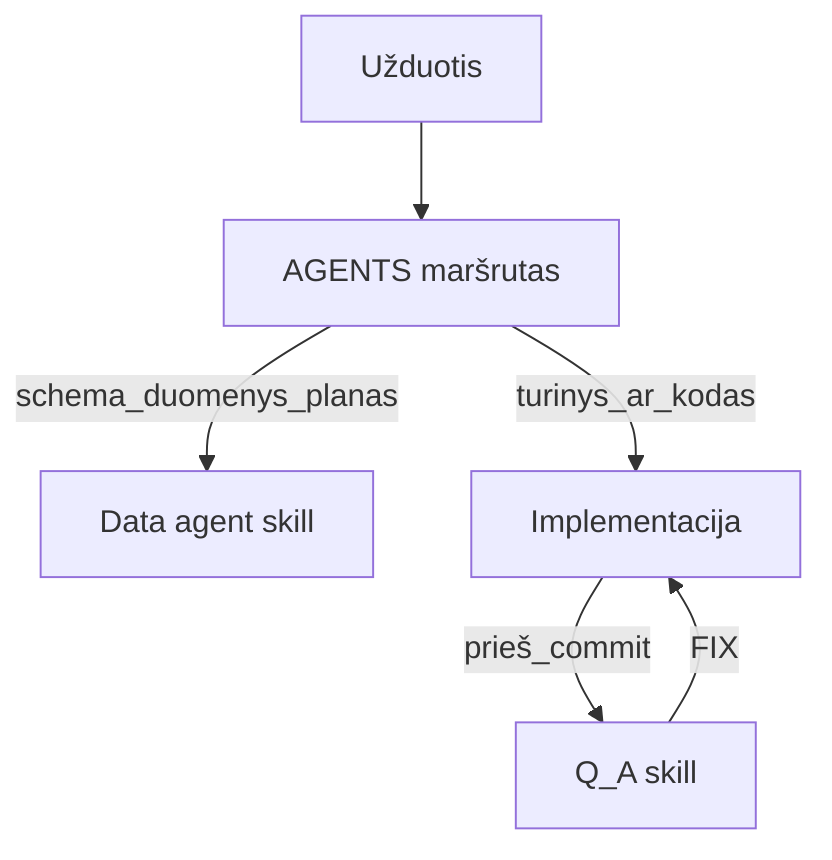

# Mermaid pavyzdžiai — Data agentas

Šablonus galima kopijuoti ir adaptuoti `SKILL.md` kontekste. Laikytis taisyklių iš pagrindinio skilo (node ID be tarpų, `subgraph id [Label]`, kabučių etiketės ant rodyčių).

## 1. Lean turinio srautas (MD → PDF → puslapis)

```mermaid
flowchart LR
  mdLt[pamoka-1-pdf.md]
  mdEn[pamoka-1-pdf-en.md]
  buildScript[build-pdf ps1 arba sh]
  pdfLt[www.promptanatomy.app.pdf]
  pdfEn[www.promptanatomy.app-en.pdf]
  indexPage[index.html to site index EN]
  mdLt --> buildScript
  mdEn --> buildScript
  buildScript --> pdfLt
  buildScript --> pdfEn
  pdfLt --> indexPage
  pdfEn --> indexPage
```

## 2. Sluoksniai: statinis deploy (GitHub Pages)

```mermaid
flowchart TD
  subgraph repo [Repozitorija]
    html[index.html]
    workflow[pages.yml]
  end
  subgraph pages [GitHub Pages]
    site[Public site]
  end
  html --> workflow
  workflow -->|"deploy"| site
```

## 3. CTA foot → hub (entity line, QW1b)

```mermaid
flowchart TB
  subgraph ctaFoot [CTA_slide_foot]
    eco[cta_ecosystem_link_site]
    entity[cta_entity_footer_app]
    legal[site_legal_footnote]
  end
  eco --> entity --> legal
  entity -->|"utm_source=cloud entity_footer"| hubApp[www_promptanatomy_app]
```

Copy and UTM canon: [AGENTS.md](../../../AGENTS.md) **„Entity footer (hub QW1b)“**. Do not treat as Tier‑1 CTA.

## 4. Orkestratoriaus logika (supaprastinta)

```mermaid
flowchart TD
  task[Užduotis]
  orch[AGENTS maršrutas]
  dataSkill[Data agent skill]
  impl[Implementacija]
  qaSkill[Q_A skill]
  task --> orch
  orch -->|"schema_duomenys_planas"| dataSkill
  orch -->|"turinys_ar_kodas"| impl
  impl -->|"prieš_commit"| qaSkill
  qaSkill -->|"FIX"| impl
```
