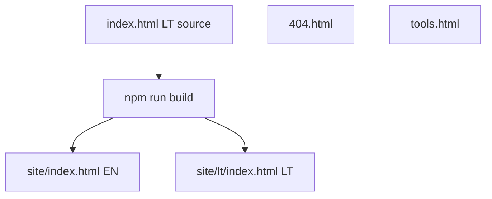

# Design System — Promptų anatomija

**Version:** 1.0  
**Last reviewed:** 2026-05-25 — [`index.html`](../index.html) `:root` (spacing + tint tokens), CTA focus/disabled block, motion tokens; satellites [404.html](../404.html), [tools.html](../tools.html) dark parity.  
**Audience:** Product owner, frontend maintainer, AI coding agents.

This document describes **what exists today**. It is not a redesign brief. Visual changes should improve **consistency and maintainability** only.

---

## 1. Architecture

| Surface | File | Stack | Role |
|---------|------|-------|------|
| **Lesson (canonical)** | [`index.html`](../index.html) | HTML + inline CSS + JS | Interactive lesson; LT editing source |
| **Lesson (deploy)** | `site/index.html` (EN), `site/lt/index.html` (LT) | Generated by `npm run build` | Same DOM/CSS as source; EN via replacements |
| **404** | [`404.html`](../404.html) | Minimal inline CSS | Error recovery |
| **Tools guide** | [`tools.html`](../tools.html) | Tailwind CDN + small custom CSS | Secondary light marketing page |
| **Search Console** | `google7305663b2567346e.html` (repo root → `site/` on build) | One-line verification file | Not lesson UI; must be at deploy root (`https://…/google7305663b2567346e.html`) |

**Build / i18n:** [`scripts/build-locale-pages.js`](../scripts/build-locale-pages.js), EN copy pairs in [`scripts/en-html-replacements.cjs`](../scripts/en-html-replacements.cjs). After visible UI changes: `npm run build` then `npm run verify`.

**Copy (not duplicated here):** [AGENTS.md](../AGENTS.md) — Golden standard (LT/EN). **DOM / slide operations:** [.cursor/rules/index-html-pamoka.mdc](../.cursor/rules/index-html-pamoka.mdc).

---

## 2. Design principles

1. **Premium dark SaaS** — clear hierarchy, minimal noise, trust-oriented (employee + manager audience).
2. **One dominant primary CTA per slide** — red action (`--accent-red`); PDF and copy are secondary tiers (see §8).
3. **Depth in 2–3 levels** — base → raised card → inset/editor; use tokenized shadows, not ad-hoc box-shadows.
4. **No stack expansion** — do not add Astro, Tailwind, or bundlers on the lesson path without an explicit product decision ([SETUP.md](../SETUP.md)).
5. **No full redesign** — preserve slide-based UX, brand triad, hero scale, library architecture.
6. **Locale-agnostic visuals** — strings in HTML/CSS still follow LT + EN triple-source rules (§10).

### CTA hierarchy (product)

| Location | Primary | Secondary |
|----------|---------|-----------|
| Hero (`#intro`) | Practice link (`.hero-primary-link` → `#guided`) | PDF (`.hero-pdf-link`) |
| Final slide (`#cta`) | Program / pricing (`.cta-btn--primary`) | PDF (`.cta-pdf-link`) |

---

## 3. Design tokens (`:root`)

**Source of truth:** [`index.html`](../index.html) `<style>` block, `:root` selector.

### 3.1 Brand colors

| Token | Value | Usage |
|-------|-------|--------|
| `--primary-blue` | `#103b5a` | Brand navy, surfaces, schema steps |
| `--accent-yellow` | `#fbd304` | Highlights, copy buttons, active nav, tabs |
| `--accent-red` | `#ff5a5f` | Primary CTAs, labels (`.label`), badges tint |
| `--bg-dark` | `#071b29` | Page base (alias via `--surface-base`) |

### 3.2 Surfaces and borders

| Token | Usage |
|-------|--------|
| `--surface-base` | `body` background |
| `--surface-raised` / `--card-bg` | Cards, library items |
| `--surface-muted` / `--surface-muted-deep` | Panels, library how-to |
| `--surface-inset` / `--surface-inset-soft` | Inset panels |
| `--border` | Standard 10% white border |
| `--border-hairline` | Subtle dividers (sections, cards) |

**Layering:** `surface-base` → `surface-raised` / `card-bg` → `surface-inset` → code blocks (`--surface-code` / `rgba(0,0,0,…)` — see §3.9).

### 3.3 Text

| Token | Value | Usage |
|-------|-------|--------|
| `--text-bright` | `#f8fafc` | Headings, primary UI text |
| `--text-body` | `#e2e8f0` | Body, prompts |
| `--text-muted` | `#cbd5e1` | Leads, subheads |
| `--text-soft` | `#94a3b8` | Meta, foot links, roadmap time |
| `--text-on-accent` | `#0a0a0a` | Text on yellow buttons |
| `--accent-yellow-hover-text` | `#fff6b0` | Yellow control hover |

### 3.4 Radius

| Token | px | Typical use |
|-------|-----|-------------|
| `--radius-xs` | 4 | Skip link, prompt editor chip |
| `--radius-sm` | 6 | Small buttons (`.types-copy-btn`) |
| `--radius-md` | 8 | CTAs, quiz, tabs |
| `--radius-lg` | 12 | Cards, prompt editor, memes |
| `--radius-tab` | 10 | Brand icon (mobile), quiz feedback |
| `--radius-pill` | 999 | Badges, nav dots, lang switch |

**Rule:** Prefer `var(--radius-*)` over literal `px` for new UI.

### 3.5 Shadows and motion

| Token | Role |
|-------|------|
| `--shadow-sm` / `--md` / `--lg` | General elevation |
| `--shadow-red-hero-rest` / `--shadow-red-hero-hover` | `.hero-primary-link` |
| `--shadow-cta-rest` / `--shadow-cta-hover` | `.cta-btn` |
| `--shadow-yellow-hover` | `.hero-pdf-link`, yellow hovers |
| `--shadow-accent-yellow` | Copy / quiz yellow buttons |
| `--shadow-editor` | `.prompt-editor` |
| `--shadow-panel-deep` | `.promo-handoff__panel` |
| `--shadow-nav-dot-active` | Active sidebar dot |
| `--lift-sm` / `--lift-md` | Hover translate on links/CTAs |
| `--ease-out` | `cubic-bezier(0.2, 0.8, 0.2, 1)` |
| `--duration-fast` | 180ms |
| `--duration-base` | 220ms |

### 3.6 Typography families

| Token | Family | Load |
|-------|--------|------|
| `--font-display` | Space Grotesk | Google Fonts (head) |
| `--font-main` | Inter | Google Fonts (head) |

### 3.7 Layout tokens

| Token | Default | Notes |
|-------|---------|--------|
| `--sidebar-rail-left` | `34px` | Sidebar dots + slide outline left offset |
| `--scroll-anchor-top` | `20px` (24px ≤1024px) | `section[id]` scroll-margin |
| `--mobile-nav-h` | `96px` at ≤1024px | `body` padding-bottom, outline position |

### 3.8 Spacing scale

| Token | Value | Usage |
|-------|-------|--------|
| `--space-2` … `--space-10` | 8–40px | Gaps, small padding |
| `--space-section-y` / `--space-section-x` | 60 / 120px | `section` desktop padding |
| `--space-section-x-md` | 90px | `section` / promo ≤1366px |
| `--space-section-rail-left` | 132px | `section` ≥1367px left rail |
| `--space-section-mobile` | `40px 20px 100px` | `section` ≤1024px |
| `--space-container-gap` | 80px | `.container` desktop |
| `--space-container-gap-md` / `-sm` | 64 / 40px | Container breakpoints |
| `--space-card-padding` / `-lg` | 18 / 21px | `.types-card` / triple grid |
| `--space-promo-block` | `44px 120px 64px` | `.promo-handoff` |
| `--space-promo-mobile` | `32px 20px 52px` | Promo ≤1024px |
| `--space-library-block` | `64px 0 76px` | `.library-slide` |

**Rule:** Prefer `var(--space-*)` for new layout; literals elsewhere — migracija §3.9.

### 3.9 Accent tints and drift

| Token | Value | Usage |
|-------|-------|--------|
| `--accent-yellow-border` | `rgba(251, 211, 4, 0.45)` | Yellow outline controls |
| `--accent-red-muted-border` | `rgba(255, 90, 95, 0.35)` | Red CTA borders |
| `--accent-red-text-muted` | `#ff7a7e` | `.result-badge` text |
| `--surface-code` | `#000` | `.prompt-editor` background |
| `--brand-wordmark` | `#f1f5f9` | `.brand-prompt` |

**Documented exceptions** (≤10): shadow definitions in `:root`, hero radial `rgba(251,211,4,0.035)`, `rgba(16,59,90,…)` surfaces, library hover `0.07`/`0.08`, `rgba(251,211,4,0.5)` tab border, `rgba(251,211,4,0.22)` outline, promo gradients, `#2aabee` (`.icon--telegram`). Naujam UI — naudoti `var(--accent-*)` / `var(--surface-*)`.

---

## 4. Typography roles

| Role | Selectors | Font | Size pattern |
|------|-----------|------|----------------|
| Display H1 | `h1`, `.hero-title-accent` | Display | `clamp(56px, 7.5vw, 104px)`, `letter-spacing: -0.02em` |
| Section H2 | `h2`, slide titles | Display | `clamp(36px, 4.2vw, 56px)` |
| Essence / closing headline | `.essence-primary-headline`, `h2.cta-title`, `h2.essence-tagline` | Display | Large clamps; mobile overrides ≤1024px |
| Lead | `.hero-intro`, `.types-lead`, `.slide-sublead`, `.schema-lead` | Main | ~16–24px clamps |
| Label | `.label`, `.types-card-k`, `.cta-secondary-label` | Main | Uppercase, `letter-spacing` 0.1–0.14em |
| UI / buttons | `.copy-prompt-btn`, `.quiz-check-btn`, `.types-copy-btn` | Main | `clamp` on font-size where set |
| Monospace | `.library-prompt-block` | System mono stack | ~13–15px |

**Do not** add a new heading level with arbitrary `font-size` without mapping to a role above.

---

## 5. Spacing and layout

### 5.1 Slide shell

- **`section`:** full width, flex center (except `#primer` — `align-items: flex-start`), `min-height: 100vh` / `100svh` / `100dvh`, bottom hairline border.
- **`section[id]`:** `scroll-margin-top: calc(var(--scroll-anchor-top) + safe-area)`.
- **Special backgrounds:** `#intro` (soft yellow radial), `#cta` (gradient to `--primary-blue`), `#primer.types-slide` (top-aligned content).

### 5.2 Content grid

- **`.container`:** `max-width: 1200px`, two columns desktop, single column ≤1024px, centered text on mobile.

### 5.3 Non-slide blocks

| Block | Element | Nav dots |
|-------|---------|----------|
| Promo handoff | `div.promo-handoff` | None (by design) |
| Meme interlude | `div.meme-interlude` | None (does not add dots) |

### 5.4 Footer patterns

There is **no global site footer**. Use contextual footers only:

| Class | Slide / context |
|-------|-----------------|
| `.hero-foot-links` | Hero secondary links |
| `.cta-foot` | Final CTA slide |
| `.schema-foot` | Schema slide |

---

## 6. Responsive breakpoints

| Media query | Effect |
|-------------|--------|
| `min-width: 1367px` | `section { padding-left: 132px }` |
| `max-width: 1366px` | Horizontal padding `90px`; container gap `64px` |
| `max-width: 1024px` | Mobile nav visible; sidebar hidden; `--mobile-nav-h: 96px`; outline moves above bottom nav; single-column layout |
| `max-width: 480px` | Brand wordmark wrap |
| `min-width: 1025px` | (additional rules in block ~1568) |
| `prefers-reduced-motion: reduce` | Disable transitions/animations on CTAs, nav, scroll |

### Mobile visual QA checklist

Test at **375px, 390px, 768px, 1024px** after CSS changes:

- [ ] All **15** slides: nav dots + mobile progress line (`#nav-mobile-progress`)
- [ ] `#primer`, `#guided`: card grids stack; copy buttons reachable
- [ ] `#library`: tabs, expand-all, category `details`, hash open
- [ ] `#quiz`: feedback visible above bottom nav (`#quiz-feedback` scroll-margin)
- [ ] `details#slide-outline` does not cover primary CTAs
- [ ] `.promo-handoff` readable above library
- [ ] Focus rings visible on tab through slide outline

---

## 7. Component catalog (lesson)

For each new UI, **reuse a row below** before inventing a class.

### 7.1 Accessibility chrome

| Class | Purpose | When to use | Don't | a11y |
|-------|---------|-------------|-------|------|
| `.skip-link` | Skip to `#main-content` | Always keep | Remove | Focus moves link on screen |
| `.visually-hidden` | Hide `#a11y-status` | Live region container | Use for visible text | `aria-live="polite"` on parent |
| `#a11y-status` | Copy/status messages | Dynamic feedback | Hard-code LT only in EN path | `uiText(lt, en)` in JS |

### 7.2 Header and language

| Class | Purpose | When to use | Don't |
|-------|---------|-------------|-------|
| `.brand-header` | Fixed top-right brand + lang | Global | Duplicate logo elsewhere |
| `.brand-lockup` | Link to www.promptanatomy.app | External brand | Change lesson canonical URL |
| `.lang-switch__btn` | LT / EN toggle | Global; `.is-active` state | New locale UI without build rules |

### 7.3 Navigation

| Class | Purpose | When to use | Don't |
|-------|---------|-------------|-------|
| `.nav-sidebar` | Desktop dot nav | 15 slides | Change dot count without adding/removing `section` + both navs |
| `.nav-mobile` | Bottom dot nav + progress | ≤1024px | — |
| `.nav-item` | Dot button | One per slide | Text labels in dots (use `aria-label`) |
| `.slide-outline` | “Turinys” jump list | Fixed; syncs from nav labels | Manual list out of sync |
| `.slide-outline__btn` | List item buttons | Generated in JS | — |

### 7.4 Hero (`#intro`)

| Class | Purpose |
|-------|---------|
| `.hero-intro` | Lead paragraph |
| `.hero-actions` | Primary + PDF row |
| `.hero-primary-link` | Primary red CTA |
| `.hero-pdf-link` | Secondary yellow outline |
| `.hero-foot-links` | Tertiary text links (44px tap target) |
| `.hero-faq` / `.hero-faq__*` | Collapsible FAQ (`details`) |

### 7.5 Cards and practice

| Class | Purpose |
|-------|---------|
| `.types-slide` | Wrapper for primer/guided slides |
| `.types-card` | Base card; modifiers `--sys`, `--ctx`, `--role` (border accent) |
| `.types-primer-cols` | Two cards on `#primer` |
| `.types-primer-quick` | Quick-start strip (not a third column card) |
| `.types-triple-grid` | Three cards on `#guided` |
| `.types-copy-btn` | Outline copy; `--practice` = subdued on guided |
| `.types-card-actions` | Copy row before `types-card-extra` on guided |
| `.types-tip` | Icon + tip banner |
| `.primer-next-cta` | Soft pill link to schema |

### 7.6 Prompt blocks (depth slides)

| Class | Purpose |
|-------|---------|
| `.prompt-editor` | Dark code card; `::before` chip (LT string — EN via replacements) |
| `.prompt-line` | Single prompt row; `<b>` labels stripped on copy |
| `.copy-prompt-btn` | Yellow filled copy |
| `.result-badge` | Outcome pill below editor (icon + text) |
| `.viz-container` / `.viz-svg` | Optional illustration area |

### 7.7 Schema and roadmap

| Class | Purpose |
|-------|---------|
| `.schema-section`, `.schema-grid`, `.schema-step`, `.schema-step--*` | Framework diagram |
| `.schema-arrow`, `.schema-bracket`, `.schema-loop-svg` | Connectors (hidden on mobile) |
| `.roadmap-slide`, `.roadmap-row`, `.roadmap-dot`, `.roadmap-time` | Journey timeline |

### 7.8 Library (`#library`)

| Class | Purpose |
|-------|---------|
| `.library-slide` | Section layout (not full viewport height) |
| `.library-toolbar` | Tabs + actions row |
| `.library-tabs` `[role="tab"]` | Employee / Manager |
| `.library-toggle-all` | Expand/collapse categories |
| `.library-toc` | Category jump links |
| `.library-cat-details` / `.library-cat-summary` | Collapsible category |
| `.library-item`, `.library-prompt-block` | Template card; empty `pre` filled by JS |
| `.library-howto` | How-to `details` |

**Library keys:** `data-emp-key`, `data-mgr-key` — must exist in `libraryPromptsLt` and `assets/prompt-library-en.js`.

### 7.9 Quiz, essence, promo, closing

| Class | Purpose |
|-------|---------|
| `.meme-interlude`, `.meme-figure` | 16:9 PNG break between slides |
| `.quiz-*` | Question, options, `.quiz-check-btn`, `.quiz-reset-btn`, `.quiz-feedback` |
| `.essence-primary-headline`, `.essence-lead` | Essence slide |
| `.promo-handoff__*` | Banner before library |
| `.cta-inner`, `.cta-btn`, `.cta-pdf-link`, `.cta-community`, `.cta-telegram-link` | Final slide |
| `.inline-link`, `--accent`, `--soft` | In-text navigation |

### 7.10 Icons

| Class | Purpose |
|-------|---------|
| `.icon` | Inline SVG wrapper; `1.15em`, `currentColor` |
| `.icon--telegram` | Telegram brand color exception |

Icons are **inline Lucide-style** SVG (ISC); do not add icon fonts.

---

## 8. CTA and button matrix

**Rule: at most one Tier 1 (red) primary action per slide.**

| Tier | Classes | Visual | Use |
|------|---------|--------|-----|
| **1 — Primary (red)** | `.hero-primary-link`, `.cta-btn`, `.cta-btn--primary` | `--accent-red`, layered red shadow | Main action |
| **2 — Secondary (yellow outline)** | `.hero-pdf-link`, `.cta-pdf-link` | Transparent + yellow border | PDF / summary download |
| **3 — Copy (yellow fill)** | `.copy-prompt-btn`, `.types-copy-btn` (default) | `--accent-yellow` bg, `--text-on-accent` | Copy prompt |
| **3b — Copy subdued** | `.types-copy-btn--practice` | Ghost on guided slide | Practice cards only |
| **4 — Quiz** | `.quiz-check-btn`, `.quiz-reset-btn` | Yellow primary / bordered ghost | Quiz slide only |
| **5 — Inline / text** | `.inline-link`, `.inline-link--accent`, `.inline-link--soft`, `.primer-next-cta` | Underline or soft pill | In-content navigation |
| **6 — Lang** | `.lang-switch__btn` | Pill; `.is-active` filled yellow | Locale |
| **7 — Library utility** | `.library-toggle-all`, tab `[role="tab"]` | Yellow accent patterns | Library chrome only |

**Shared behavior**

- Global `:focus-visible` — 2px `--accent-yellow`, offset 3px.
- Disabled: `.copy-prompt-btn`, `.types-copy-btn`, `.quiz-check-btn` — shared disabled block; use `aria-busy` when copying.
- Motion: prefer `var(--duration-fast)` and `var(--ease-out)` on new buttons (some legacy `0.2s` on quiz — align in v1.0 backlog).

**Don't**

- Add a new red `<a>` or `<button>` without mapping to Tier 1.
- Mix Tier 1 and Tier 3 on the same row without clear visual hierarchy.

---

## 9. Accessibility baseline

Not a WCAG certification document; records **implemented** patterns.

| Pattern | Implementation |
|---------|----------------|
| Skip link | `.skip-link` → `#main-content` |
| Focus | `:focus-visible` on interactive elements |
| Landmarks | `header`, `nav`, `main`, `section[aria-label]` |
| Nav | Dots use `aria-label` (`Skaidrė N:` / `Slide N:` in EN build) |
| Live region | `#a11y-status` for copy and library toggle messages |
| Tabs | Library `role="tablist"` / `role="tab"` / `aria-selected` |
| Reduced motion | `@media (prefers-reduced-motion: reduce)` — CTAs and nav |
| Touch targets | `.hero-foot-links a` min-height 44px |

**EN locale audit:** [EN_LOCALE_UI_UX_AUDIT_2026-04-18.md](EN_LOCALE_UI_UX_AUDIT_2026-04-18.md).

**CSS `content` strings** (e.g. `.prompt-editor::before`) must have EN pairs in `en-html-replacements.cjs` if user-visible.

---

## 10. i18n and the design system

Visual tokens are locale-agnostic. **Text is not.**

| Change type | Touch |
|-------------|--------|
| Visible LT HTML | `index.html` |
| EN static HTML | `scripts/en-html-replacements.cjs` (+ `build-locale-pages.js` for head meta) |
| Copyable library | `libraryPromptsLt` + `assets/prompt-library-en.js` |
| Runtime messages | `uiText(lt, en)` → `#a11y-status`, dynamic labels |

**Verify:** `npm run build && npm run verify` ([AGENTS.md](../AGENTS.md) § Dviguba patikra).

---

## 11. Satellite pages

### 11.1 [`404.html`](../404.html)

| Aspect | Implementation |
|--------|----------------|
| Background | `--surface-base` / `--bg-dark` |
| Accent CTA | `--accent-yellow`, `--radius-md` |
| Fonts | Inter + Space Grotesk (Google Fonts) |
| Focus | 2px `--accent-yellow` outline (matches lesson) |

Minimal page — no slide nav or lesson JS.

### 11.2 [`tools.html`](../tools.html)

**Policy (v1.0):** Secondary marketing surface — **dark parity** with lesson brand; inline CSS only (no Tailwind).

| Aspect | Implementation |
|--------|----------------|
| Stack | Single-file inline CSS + token subset in `:root` |
| Page bg | `--surface-base`; card `--surface-raised` |
| Brand | `--primary-blue`, `--accent-yellow`, `--text-on-accent` on gold pills |
| Typography | Space Grotesk (headlines), Inter (body) |
| Layout | CSS Grid 4 → 2 → 1 columns |

**Components (tools-only)**

| Class | Purpose |
|-------|---------|
| `.category-pill` + `.bg-cat-1` / `.bg-cat-2` | Section label (navy vs gold) |
| `.tool-list` / `.tool-item` / `.tool-dot` | Tool listing with tree line |
| `.version-tag` | Small metadata chip |
| `.header-title` | Hero headline |
| `.page-shell` / `.page-header` / `.page-footer` | Page chrome |

### 11.3 Brand mapping (satellites → lesson)

| Semantic | Lesson token | 404 | tools.html |
|----------|--------------|-----|------------|
| Page dark bg | `--bg-dark` | `--surface-base` | `--surface-base` |
| Accent gold | `--accent-yellow` | `--accent-yellow` | `--accent-yellow` |
| Navy | `--primary-blue` | — | `.bg-cat-1` |

---

## 12. Do / Don't

### Do

- Use `:root` tokens for colors, radius, shadows, and motion on new lesson UI.
- Map new buttons to §8 tier before styling.
- Add slides with matching `.nav-sidebar` and `.nav-mobile` items and `aria-label`s.
- Update this doc when adding a **public** CSS class or token.
- Run `npm run build && npm run verify` after EN-visible changes.

### Don't

- Redesign hero layout, `h1` scale, or slide-based navigation model.
- Hand-fill `.library-prompt-block` without JS library keys.
- Introduce Tailwind or a bundler on `index.html` without explicit approval.
- Add a seventh red CTA variant.
- Rely on [LT_EN_UI_UX_REPORT.md](../LT_EN_UI_UX_REPORT.md) for architecture — it describes an obsolete `generator.js` / `style.css` stack.

---

## 13. Making changes (workflow)

1. **Classify:** token | component | copy | satellite page.
2. **Edit** [`index.html`](../index.html) (lesson); satellites only if in scope.
3. **EN:** update [`scripts/en-html-replacements.cjs`](../scripts/en-html-replacements.cjs) for visible strings / `aria-label` / CSS `content`.
4. **Library:** sync LT + EN keys if applicable.
5. **Document:** update §3–§8 in this file if tokens or public classes changed.
6. **Verify:** `npm run build && npm run verify`.
7. **QA:** §6 mobile checklist + keyboard tab through hero, library, quiz.

---

## 14. v1.0 Definition of Done

**Status:** v1.0 shipped in repo (2026-05-25). Production visual sign-off on promptanatomy.cloud — PO after deploy.

- [x] Token consistency: brand/accent/surface/text via `:root`; documented exceptions ≤10 (§3.9).
- [x] Spacing scale: `--space-*` on `section`, `.container`, types/library/promo.
- [x] Tint tokens: `--accent-yellow-*`, `--accent-red-*`, `--surface-code`, `--brand-wordmark`.
- [x] CTA matrix: shared `:focus-visible` / `:disabled` / `aria-busy` for tier 1–4 controls.
- [x] Motion: tier buttons use `--duration-fast` / `--duration-base` + `--ease-out`.
- [x] Satellites: [404.html](../404.html) fonts + tokens; [tools.html](../tools.html) dark parity, no Tailwind.
- [ ] Mobile QA (§6) on live deploy — manual smoke 375 / 768 / 1024 px.
- [ ] Production visual sign-off on promptanatomy.cloud.

### Post–v1.0 backlog

| Task | Notes |
|------|--------|
| `#primer` / `#guided` → modifier classes | Reduce ID-specific CSS |
| Typography orphan audit | Enforce five roles on new UI only |
| LT locale for `tools.html` | EN-only today |

---

## 15. Related documents

| Document | Role |
|----------|------|
| [AGENTS.md](../AGENTS.md) | Agent routing, copy golden standard, i18n, release |
| [SETUP.md](../SETUP.md) | Local build, release checklist |
| [.cursor/rules/index-html-pamoka.mdc](../.cursor/rules/index-html-pamoka.mdc) | Slide order, library keys, DOM rules |
| [.cursor/skills/q-a-agent/SKILL.md](../.cursor/skills/q-a-agent/SKILL.md) | Pre-commit QA |
| [CHANGELOG.md](../CHANGELOG.md) | UI change history |
| [EN_LOCALE_UI_UX_AUDIT_2026-04-18.md](EN_LOCALE_UI_UX_AUDIT_2026-04-18.md) | EN locale / a11y audit |
| [LT_EN_UI_UX_REPORT.md](../LT_EN_UI_UX_REPORT.md) | **Deprecated** — see banner at top of that file |

---

*Maintainers: when `:root` or major component CSS changes in `index.html`, update §3–§8 and bump **Last reviewed**.*
