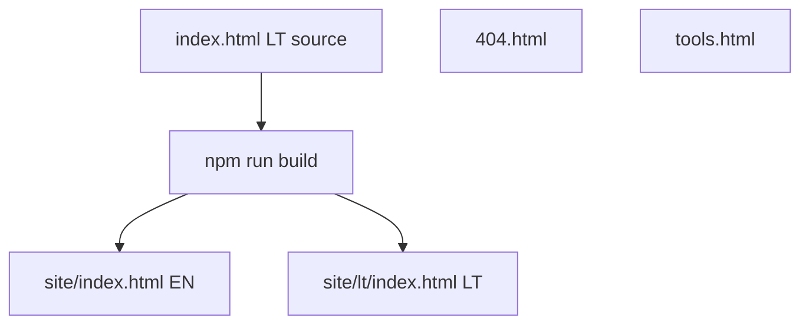

# Design System — Promptų anatomija

**Version:** 3.1  
**Last reviewed:** 2026-10-02 — `#intro` is one 1200px frame: 55/45 hero, one before/after card, then a `.intro-strip` with min-height 64px. Hero proof stays a four-line summary of the weekly task. `#guided` is that pair plus a quiet strip; Po is the copyable expansion of the same fields, not a baked figure. Hero PDF is a tertiary text link in that strip. Illustration bake colors come from `styles/tokens.css` (`illustration-colors.cjs`). Canvas sizes match `scenes.mjs`: six scenes at 800×900. Template figures display at `max-width: 420px` on a 1.45 / 0.75 track (the picture column is the narrow one; it swaps when the figure is the first child). No large yellow fill in those six scenes. Slugs: check, meeting, levels, feedback, team, letter. PNG/WebP ship on `PUBLIC_FILES`; bake fonts do not. Type scale adds display / hero / title / body. Hero `h1` uses `--font-size-hero` (44px at 375px, 72px at 1440px). Section `h2` stays on the title scale. Essence and CTA headlines use `--font-size-display`. Schema step type is 22 / 17 / 16 px on one vertical axis. Slide count stays closed.  
**Audience:** Product owner, frontend maintainer, AI coding agents.

This document describes **what exists today**. It is not a redesign brief. Visual changes should improve **consistency and maintainability** only.

### Semver (this product)

| Range | Meaning |
|-------|---------|
| **2.x** | No breaking visual contracts: CTA tiers (§8), public token names, slide-based UX |
| **3.0** | Opened baked `.viz-figure` scenes. Intro later left the bake; the live set is six scenes (see v3.0 DoD). Hero scale stayed closed until 3.1. Hub restyle and slide-count changes stay closed |
| **3.1** | Single color source for lesson CSS + illustrations; illustration-color + hex + contrast-fixture verify; display/hero/title/body type tokens. The intro frame stays 1200px / 55/45. `#intro h1` uses `--font-size-hero`. Essence and CTA use `--font-size-display` |

### v1.5 / v2.x scope

| Allowed | Not allowed |
|---------|-------------|
| Token / motion / type-scale unification | Hero `h1` scale, layout redesign |
| Modifier classes instead of ID-specific CSS | New brand colors outside documented accents, 7th red CTA |
| Doc sync + strict `verify:design-tokens` | Tailwind or bundler on `index.html` |
| Satellite token subset via shared CSS | Stack expansion without approval |

---

## 1. Architecture

| Surface | File | Stack | Role |
|---------|------|-------|------|
| **Lesson (canonical)** | [`index.html`](../index.html) | HTML + inline CSS + JS | Interactive lesson; LT editing source; `:root` synced from [`styles/tokens.css`](../styles/tokens.css) via `npm run build` / inject |
| **Design tokens (source)** | [`styles/tokens.css`](../styles/tokens.css) | CSS `:root` | Single canonical token file; do not edit duplicated `:root` in HTML |
| **Lesson (deploy)** | `site/index.html` (EN), `site/lt/index.html` (LT) | Generated by `npm run build` | Same DOM/CSS as source; EN via replacements |
| **404** | [`404.html`](../404.html) | Minimal inline CSS | Error recovery |
| **Tools guide** | [`tools.html`](../tools.html) | Inline CSS + token subset | Secondary marketing; dark parity with lesson |
| **Search Console** | `google7305663b2567346e.html` (repo root → `site/` on build) | One-line verification file | Not lesson UI; must be at deploy root (`https://…/google7305663b2567346e.html`) |

```mermaid
flowchart TB
  indexHtml[index.html LT source]
  build[npm run build]
  siteEn[site/index.html EN]
  siteLt[site/lt/index.html LT]
  err404[404.html]
  tools[tools.html]
  indexHtml --> build
  build --> siteEn
  build --> siteLt
```

**Build / i18n:** [`scripts/build-locale-pages.js`](../scripts/build-locale-pages.js), EN copy pairs in [`scripts/en-html-replacements.cjs`](../scripts/en-html-replacements.cjs). After visible UI changes: `npm run build` then `npm run verify`.

**Copy (not duplicated here):** [AGENTS.md](../AGENTS.md) — Golden standard (LT/EN). **DOM / slide operations:** [.cursor/rules/index-html-pamoka.mdc](../.cursor/rules/index-html-pamoka.mdc).

---

## 2. Design principles

1. **Premium dark SaaS** — clear hierarchy, minimal noise, trust-oriented (employee + manager audience).
2. **One dominant primary CTA per slide** — red action (`--accent-red`); PDF and copy are secondary tiers (see §8).
3. **Depth in 2–3 levels** — base → raised card → inset/editor; use tokenized shadows, not ad-hoc box-shadows.
4. **No stack expansion** — do not add Astro, Tailwind, or bundlers on the lesson path without an explicit product decision ([SETUP.md](../SETUP.md)).
5. **No full redesign** — preserve slide-based UX, brand triad, hero scale, library architecture.
6. **Locale-agnostic visuals** — strings in HTML/CSS still follow LT + EN triple-source rules (§10).

### CTA hierarchy (product)

| Location | Primary | Secondary |
|----------|---------|-----------|
| Hero (`#intro`) | Practice link (`.hero-primary-link` → `#guided`) | None in `.hero-actions`. PDF is a tertiary text link (`.hero-pdf-link`) in `.intro-strip`, with library, CEO kit, tools, and DUK |
| Final slide (`#cta`) | Program / pricing (`.cta-btn--primary`) | PDF (`.cta-pdf-link` + `.btn-pdf-outline`) |

### 2.1 Decision recipes (authors / agents)

**New control / button**

1. Map to §8 tier before writing CSS.
2. At most one **Tier 1 (red)** per slide.
3. Final-slide PDF → Tier 2 (`.btn-pdf-outline`). Hero PDF stays a tertiary text link in `.intro-strip`. Copy prompt → Tier 3. Do not invent a new red variant.

**New text block**

1. Pick a §4 typography role (`lead`, `label`, `UI`, display H1/H2, mono).
2. Use `var(--font-size-*)` / `var(--lh-body)` / `var(--measure-prose)` — do not invent a one-off `font-size` outside roles.
3. Chrome / labels: floor **≥12px** (interactive chrome target **13px** via `--font-size-label`). `verify:typography-roles` exits 1 when a rule can render below 12px (`clamp()` bounds, and `em`/`rem` at a 16px root) and on orphan `font-size` above 32px.

**New `details` / disclosure**

1. Reuse `.disclosure-chip*` (modifiers `--nav` / `--inline`) — do not invent a parallel chip.

**Readability contracts**

- Lead ≤ 2 sentences; card description ≤ 1 sentence.
- One Tier-1 CTA per slide.
- Body / lead color never below `--text-muted` on `--surface-base` for content that must be read.
- Reserve `--text-soft` for true meta (taglines, progress chrome) — not primary card copy.
- Do not use opacity alone to create readable contrast on body text.

### 2.2 Public vs private tokens

| Tier | Examples | Rule |
|------|----------|------|
| **Public** | Brand triad, `--accent-teal*`, `--surface-light`, `--surface-stage-card`, `--text-ink`, `--text-ink-muted`, text roles (`--text-bright` … `--text-tertiary`), `--radius-md` / `--radius-lg`, `--duration-*`, `--space-4` / `6` / `8`, `--font-size-label` / `ui` / `lead` / `display` / `hero` / `title` / `body`, `--measure-prose`, `--tracking-label`, `--tap-min` | Prefer these in new UI |
| **Private** | Yellow tint ladder (four public steps below; other `--accent-yellow-*` keep current values), `--surface-stage`, `--text-ink-faint` / `--text-ink-mid`, most `--white-alpha-*` | Implementation detail; reuse existing step, do not add a new alpha without documenting |

**Yellow public steps (v3.1, alias-only):** prefer `--accent-yellow-border` (0.45), `--accent-yellow-bg-fill` (0.08), `--accent-yellow-bg-hover` (0.07), `--accent-yellow-bg-emphasis` (0.14). Other yellow names stay at today’s values. Do not mint a new yellow opacity.

---

## 3. Design tokens (`:root`)

**Source of truth:** [`styles/tokens.css`](../styles/tokens.css) — injected into HTML via `npm run build` / `inject-design-tokens`. Do not hand-edit `:root` between `DS_TOKENS_*` markers.

### 3.1 Brand colors

| Token | Value | Usage |
|-------|-------|--------|
| `--primary-blue` | `#103b5a` | Brand navy, surfaces; schema QC left rule (`.schema-step--qc`) |
| `--accent-yellow` | `#fbd304` | Highlights, copy buttons, active nav, tabs |
| `--accent-red` | `#ff5a5f` | Primary CTAs, labels (`.label`), badges tint |
| `--accent-teal` | `#0d9488` | Context card border (`.types-card--ctx`) |
| `--accent-teal-deep` | `#047857` | Schema reason left rule (`.schema-step--reason`) |
| `--primary-blue-deep` | `#0c2d45` | Deep navy token; not used on the schema diagram |
| `--primary-blue-wash` | `rgba(16, 59, 90, 0.85)` | Illustration stage wash |
| `--bg-dark` | `#071b29` | Page base (alias via `--surface-base`) |

### 3.2 Surfaces and borders

| Token | Usage |
|-------|--------|
| `--surface-base` | `body` background |
| `--surface-raised` / `--card-bg` | Cards, library items |
| `--surface-muted` / `--surface-muted-deep` | Panels, library how-to |
| `--surface-inset` / `--surface-inset-soft` | Inset panels |
| `--surface-light` | Illustration light cards. Schema steps use `--surface-paper` |
| `--surface-paper` | Schema steps 1–3 (`#f7f9fb`) |
| `--surface-reason` | Schema step 4 wash (`#d7ebe3`) |
| `--surface-qc` | Schema step 5 wash (`#d5e2ee`) |
| `--surface-light-bar` | Illustration letter chrome bar |
| `--surface-navy-deep` | Brand lockup gradient start |
| `--surface-stage` | Illustration stage fill (private; lesson CSS does not use it) |
| `--surface-stage-card` | Illustration raised card and `#intro` proof card |
| `--border` | Standard 10% white border |
| `--border-hairline` | Subtle dividers (sections, cards) |

**Layering:** `surface-base` → `surface-raised` / `card-bg` → `surface-inset` → code blocks (`--surface-code` / `rgba(0,0,0,…)` — see §3.9).

### 3.3 Text

| Token | Value | Usage |
|-------|-------|--------|
| `--text-bright` | `#f8fafc` | Headings, primary UI text |
| `--text-body` | `#e2e8f0` | Body, prompts |
| `--text-muted` | `#cbd5e1` | Leads, subheads, readable secondary |
| `--text-soft` | `#94a3b8` | Meta only (taglines, progress chrome) |
| `--text-on-accent` | `#0a0a0a` | Text on yellow / red buttons; illustration risk mark |
| `--accent-yellow-hover-text` | `#fff6b0` | Yellow control hover |
| `--text-ink` | `#0f172a` | Text on `--surface-light` (schema + illustrations) |
| `--text-ink-muted` | `#475569` | Meta on light cards: illustrations and `#intro` „Po“ lines |
| `--text-ink-body` | `#405064` | Schema step description on `--surface-paper` |
| `--text-ink-faint` | `rgba(15, 23, 42, 0.08)` | Illustration hairlines on light cards (private) |
| `--text-ink-mid` | `rgba(15, 23, 42, 0.35)` | Illustration bar on yellow row (private) |
| `--text-on-navy-cool` | `#e0f2fe` | Light text on navy. Schema steps no longer use it |
| `--text-tertiary` | `rgba(255,255,255,0.82)` | Tertiary links / subdued chrome (`.link-tier-tertiary`) |
| `--text-secondary` | `rgba(255,255,255,0.88)` | On-dark secondary (foot variants) |
| `--text-on-dark-high` | `var(--text-tertiary)` | **Deprecated alias** (v2.0) |
| `--text-on-dark-muted` | `var(--text-secondary)` | **Deprecated alias** (v2.0) |

### 3.3a Type scale and measure (v2.1)

| Token | Value | Usage |
|-------|--------|--------|
| `--font-size-label` | `13px` | Labels, disclosure summary, copy chrome, lang switch |
| `--font-size-ui` | `14px` | Compact UI |
| `--font-size-lead` | `clamp(16px, 1.25vw, 19px)` | `.slide-lead` |
| `--font-size-display` | `clamp(56px, 7.5vw, 104px)` | `h2.essence-tagline`, `h2.cta-title` at every width |
| `--font-size-hero` | `clamp(44px, 5vw, 72px)` | The only `h1` (`#intro`). 44px at 375px, 72px at 1440px. Line-height 1.12 |
| `--font-size-title` | `clamp(36px, 4.2vw, 56px)` | Section `h2` at every width |
| `--font-size-body` | `clamp(14px, 1.05vw, 16px)` | Repeated body / card copy |
| `--lh-body` | `1.5` | Lead / prose line-height |
| `--measure-prose` | `34em` | Lead / FAQ panel max-width |
| `--tracking-label` | `0.12em` | `.label`, `.disclosure-chip__summary` |

### 3.4 Radius

| Token | px | Typical use |
|-------|-----|-------------|
| `--radius-xs` | 4 | Skip link, prompt editor chip |
| `--radius-sm` | 6 | Small buttons (`.types-copy-btn`) |
| `--radius-md` | 8 | CTAs, quiz, tabs |
| `--radius-lg` | 12 | Cards, prompt editor, memes |
| `--radius-tab` | 10 | Brand icon (mobile), quiz feedback |
| `--radius-pill` | 999 | Badges, nav dots, lang switch |

**Rule:** Prefer `var(--radius-*)` over literal `px` for new UI.

### 3.5 Shadows and motion

| Token | Role |
|-------|------|
| `--shadow-sm` | General elevation |
| `--shadow-md` | General elevation |
| `--shadow-lg` | General elevation |
| `--shadow-red-hero-rest` / `--shadow-red-hero-hover` | `.hero-primary-link` |
| `--shadow-cta-rest` / `--shadow-cta-hover` | `.cta-btn` |
| `--shadow-yellow-hover` | `.btn-pdf-outline:hover` |
| `--shadow-accent-yellow` | Copy / quiz yellow buttons |
| `--shadow-editor` | `.prompt-editor` |
| `--shadow-panel-deep` | `.promo-handoff__panel` |
| `--shadow-nav-dot-active` | Active sidebar dot |
| `--lift-sm` / `--lift-md` | Hover translate on links/CTAs |
| `--ease-out` | `cubic-bezier(0.2, 0.8, 0.2, 1)` |
| `--duration-fast` | 180ms |
| `--duration-base` | 220ms |

**Motion rule (v1.5):** All interactive transitions use `var(--duration-fast)` or `var(--duration-base)` with `var(--ease-out)`. No hardcoded `0.18s` / `0.25s` / bare `ease` in component CSS.

### 3.6 Typography families

| Token | Family | Load |
|-------|--------|------|
| `--font-display` | Space Grotesk | Google Fonts, weight 700 |
| `--font-main` | Inter | Google Fonts, weights 400, 600, 700, 800 |

### 3.7 Layout tokens

| Token | Default | Notes |
|-------|---------|--------|
| `--sidebar-rail-left` | `34px` | Sidebar dots + slide outline left offset |
| `--scroll-anchor-top` | `20px` (24px ≤1024px) | `section[id]` scroll-margin |
| `--sidebar-rail-width` | `140px` | Fixed dot column. Content starts to its right |
| `--mobile-nav-h` | `96px`, then the live bar height ≤1024px | Outline sits above the in-flow mobile nav |
| `--tap-min` | `44px` | Mobile nav item hit area. Not desktop 11px dots |

### 3.8 Spacing scale

| Token | Value | Usage |
|-------|-------|--------|
| `--space-2` | 8px | Gaps, small padding |
| `--space-3` | 12px | Gaps |
| `--space-4` | 16px | Gaps |
| `--space-5` | 20px | Gaps |
| `--space-6` | 24px | Gaps |
| `--space-8` | 32px | Gaps |
| `--space-10` | 40px | Gaps |
| `--space-section-y` / `--space-section-x` | 60 / 120px | `section` desktop padding |
| `--space-section-x-md` | 90px | `section` / promo ≤1366px |
| `--space-section-rail-left` | `sidebar-rail-left + sidebar-rail-width + space-6` | `section`, promo, meme left inset from 1025px, clear of the fixed dots |
| `--space-section-mobile` | `40px 20px 40px` | `section` ≤1024px. The bar is outside the scrollport |
| `--space-container-gap` | 80px | `.container` desktop |
| `--space-container-gap-md` | 64px | Container ≤1366px |
| `--space-container-gap-sm` | 40px | Container ≤1024px |
| `--space-card-padding` | 18px | `.types-card` |
| `--space-card-padding-lg` | 21px | Large-card padding step. The guided pair uses `.types-card` padding (`--space-card-padding`) |
| `--space-promo-block` | `44px 120px 64px` | `.promo-handoff` |
| `--space-promo-mobile` | `32px 20px 52px` | Promo ≤1024px |
| `--space-library-block` | `64px 0 76px` | `.library-slide` |

**Rule:** Prefer `var(--space-*)` for new layout; literals elsewhere — migracija §3.9.

### 3.9 Accent tints (full catalog)

| Token | Value | Usage |
|-------|-------|--------|
| `--accent-yellow-border` | `rgba(251, 211, 4, 0.45)` | Yellow outline controls |
| `--accent-yellow-border-faint` | `rgba(251, 211, 4, 0.28)` | Nav dot active glow |
| `--accent-yellow-border-soft` | `rgba(251, 211, 4, 0.35)` | Copy button shadow ref |
| `--accent-yellow-border-strong` | `rgba(251, 211, 4, 0.55)` | Active tab border |
| `--accent-yellow-outline-soft` | `rgba(251, 211, 4, 0.32)` | Soft outlines |
| `--accent-yellow-nav-idle` | `rgba(251, 211, 4, 0.4)` | Sidebar dot idle |
| `--accent-yellow-nav-hover` | `rgba(251, 211, 4, 0.68)` | Sidebar dot hover |
| `--accent-yellow-bg-subtle` | `rgba(251, 211, 4, 0.1)` | Subtle yellow fills |
| `--accent-yellow-bg-mid` | `rgba(251, 211, 4, 0.12)` | Mid yellow fills |
| `--accent-yellow-bg-hover` | `rgba(251, 211, 4, 0.07)` | Library / how-to hover |
| `--accent-yellow-bg-faint` | `rgba(251, 211, 4, 0.06)` | Promo gradient stop |
| `--accent-yellow-bg-fill` | `rgba(251, 211, 4, 0.08)` | Library chrome, inline-link hover |
| `--accent-yellow-bg-emphasis` | `rgba(251, 211, 4, 0.14)` | `.library-toggle-all:hover` |
| `--accent-yellow-bg-glow` | `rgba(251, 211, 4, 0.22)` | Mobile nav active glow; illustration highlight |
| `--accent-red-muted-border` | `rgba(255, 90, 95, 0.35)` | Red CTA borders |
| `--accent-red-border-strong` | `rgba(255, 90, 95, 0.55)` | Strong red borders |
| `--accent-red-border-emphasis` | `rgba(255, 90, 95, 0.65)` | Emphasis red borders |
| `--accent-red-bg-subtle` | `rgba(255, 90, 95, 0.14)` | Subtle red fills |
| `--accent-red-quiz-bg` | `rgba(255, 90, 95, 0.1)` | Quiz option tint |
| `--accent-red-text-muted` | `#ff7a7e` | `.result-badge` text |
| `--surface-code` | `#000` | `.prompt-editor` background |
| `--brand-wordmark` | `#f1f5f9` | `.brand-prompt` |
| `--surface-overlay` | `rgba(7, 27, 41, 0.94)` | Disclosure chip summary (`.disclosure-chip__summary`) |
| `--surface-overlay-mid` | `rgba(7, 27, 41, 0.92)` | Slide outline hover panel |
| `--surface-overlay-strong` | `rgba(7, 27, 41, 0.97)` | Disclosure panel (`.disclosure-chip__panel`) |
| `--border-subtle` | `rgba(255, 255, 255, 0.16)` | Mobile nav idle border |
| `--border-control` | `rgba(255, 255, 255, 0.18)` | Lang switch idle border |
| `--border-control-hover` | `rgba(255, 255, 255, 0.28)` | Lang switch hover border |
| `--nav-dot-idle-border` | `rgba(255, 255, 255, 0.14)` | Mobile nav dot ring |
| `--nav-dot-idle-bg` | `rgba(255, 255, 255, 0.035)` | Mobile nav dot fill |
| `--text-on-dark-high` | *(alias → `--text-tertiary`)* | Prefer `--text-tertiary` |
| `--text-on-dark-muted` | *(alias → `--text-secondary`)* | Prefer `--text-secondary` |
| `--white-alpha-04` | `rgba(255, 255, 255, 0.04)` | Mobile nav dot fill |
| `--white-alpha-06` | `rgba(255, 255, 255, 0.06)` | Quiz option idle bg |
| `--white-alpha-08` | `rgba(255, 255, 255, 0.08)` | Library border, SVG stroke |
| `--white-alpha-12` | `rgba(255, 255, 255, 0.12)` | Schema step border |
| `--white-alpha-20` | `rgba(255, 255, 255, 0.2)` | Schema / library borders |
| `--white-alpha-22` | `rgba(255, 255, 255, 0.22)` | Quiz reset hover border |
| `--white-alpha-90` | `rgba(255, 255, 255, 0.9)` | Schema step number |
| `--shadow-chip` | `0 10px 28px rgba(0,0,0,0.4)` | Disclosure summary elevation |
| `--shadow-outline-panel` | `0 14px 36px rgba(0,0,0,0.45)` | Disclosure panel elevation |

**Rule:** New component UI uses `var(--accent-*)` / `var(--surface-*)`, not raw `rgba(251,…)` / `rgba(255,90,…)`.

#### Documented exceptions (not migrated to tokens)

These may remain as literals; `verify:design-tokens` does not fail on them:

- `rgba` inside `--shadow-*` definitions in `:root`
- Hero `#intro` radial: `rgba(251, 211, 4, 0.035)`
- Promo / CTA gradients: `rgba(16, 59, 90, …)` + yellow mix
- Primer, library, and promo navy fills already in component CSS: `rgba(16, 59, 90, 0.22–0.48)`. Leave them as literals; the nearest token would change the fill
- `.icon--telegram` brand color: `#2aabee`
- Quiz option focus ring: `rgba(255, 90, 95, 0.45)` (one-off emphasis)
- Component CSS hex: only `.icon--telegram` `#2aabee` (`verify:design-tokens`)

---

## 4. Typography roles

| Role | Selectors | Font | Size pattern |
|------|-----------|------|----------------|
| Hero H1 | `h1`, `#intro h1` | Display | `var(--font-size-hero)`, line-height 1.12, max-width 14em (44px at 375px, 72px at 1440px). `.hero-title-accent` is color only |
| Section H2 | `h2`, slide titles | Display | `var(--font-size-title)` at every width. No mobile clamp |
| Essence / closing headline | `h2.cta-title`, `h2.essence-tagline` | Display | `var(--font-size-display)` at every width. Do not put a second clamp on these |
| Lead | `.slide-lead` (+ `.hero-intro`, `.types-lead`, `.slide-sublead`, `.schema-lead`) | Main | `var(--font-size-lead)`, `line-height: var(--lh-body)`, `max-width: var(--measure-prose)` where set |
| Label | `.label`, `.types-card-k`, `.cta-secondary-label`, `.disclosure-chip__summary` | Main / Display | `--font-size-label`. Uppercase; `letter-spacing: var(--tracking-label)` on `.label` / disclosure |
| UI / buttons | `.copy-prompt-btn`, `.quiz-check-btn`, `.types-copy-btn` | Main | `--font-size-label` or `clamp` where set |
| Monospace | `.library-prompt-block` | System mono stack | ~13–15px |

**Do not** add a new heading level with arbitrary `font-size` without mapping to a role above.

---

## 5. Spacing and layout

### 5.1 Slide shell

- **`section`:** full width, flex center (except `.types-slide--primer` — `align-items: flex-start`), `min-height: 100vh` / `100svh` / `100dvh`, bottom hairline border.
- **`section[id]`:** `scroll-margin-top: calc(var(--scroll-anchor-top) + safe-area)`.
- **Special backgrounds:** `#intro` (soft yellow radial), `#cta` (gradient to `--primary-blue`), `.types-slide--primer` (top-aligned content).
- **Slide modifiers:** `id="primer"` + `class="types-slide types-slide--primer"`; `id="guided"` + `class="types-slide types-slide--guided"`. Style via modifiers; keep IDs for anchors and JS.

### 5.2 Content grid

- **`.container`:** `max-width: 1200px`, two columns desktop, single column ≤1024px, centered text on mobile.

### 5.3 Non-slide blocks

| Block | Element | Nav dots |
|-------|---------|----------|
| Promo handoff | `div.promo-handoff` | None (by design) |
| Meme interlude | `div.meme-interlude` | None (does not add dots) |

### 5.4 Footer patterns

There is **no global site footer**. Use contextual footers only:

| Class | Slide / context |
|-------|-----------------|
| `.hero-foot-links` | Hero secondary links |
| `.cta-ecosystem-link` | Final CTA — tertiary map link to `.site` |
| `.cta-entity-footer` | Final CTA — hub entity line (QW1b) above legal footnote; body/small + `.link-tier-tertiary`; not a card/promo; copy/UTM in [AGENTS.md](../AGENTS.md) |
| `.cta-foot` / `.site-legal-footnote` | Final CTA slide — publisher name, postal address, `mailto:` (canonical: [scripts/legal-contact.cjs](../scripts/legal-contact.cjs)) |
| `.schema-foot` | Schema slide |

---

## 6. Responsive breakpoints

| Media query | Effect |
|-------------|--------|
| `min-width: 1025px` | Left inset `--space-section-rail-left` on sections, promo, and meme so the fixed dots stay in the gutter |
| `max-width: 1366px` | Right padding `90px`; container gap `64px`. Left inset stays the rail |
| `max-width: 1024px` | Sidebar hidden. Mobile nav is in document flow under `#main-content` (the scrollport). Slide min-height is the scrollport (`100cqh`), not the viewport. Outline uses the measured bar height |
| `max-width: 480px` | Brand wordmark wrap |
| `min-width: 1025px` | (additional rules in block ~1568) |
| `prefers-reduced-motion: reduce` | Disable transitions/animations on CTAs, nav, scroll |

### Mobile visual QA checklist

Test at **375px, 390px, 768px, 1024px** after CSS changes:

- [ ] All **15** slides: nav dots + mobile progress line (`#nav-mobile-progress`)
- [ ] `#primer`, `#guided`: card grids stack; copy buttons reachable
- [ ] `#library`: tabs, expand-all, category `details`, hash open
- [ ] `#quiz`: feedback visible above bottom nav (`#quiz-feedback` scroll-margin)
- [ ] `details#slide-outline` does not cover primary CTAs
- [ ] `.promo-handoff` readable above library
- [ ] Focus rings visible on tab through slide outline

### Mobile QA log

| Date | Build | Viewports | Tester | Result |
|------|-------|-----------|--------|--------|
| 2026-05-25 | `site/lt/` + `site/` (post v1.5) | 375, 390, 768, 1024 | Agent smoke (structural) | Pass — nav 15 slides, primer/guided modifiers, library tabs, quiz feedback margin, outline focus |
| 2026-05-25 | post DS v2.0 | 375, 390, 768, 1024 | Agent smoke | Pass — `.disclosure-chip*`, hero mobile center, `tools-lt.html`; see [DS_A11Y_SMOKE_v2.md](DS_A11Y_SMOKE_v2.md) |
| 2026-07-29 | post DS v2.1 | 375, 768, 1024 | Agent structural + checklist | Pass — chrome ≥13px disclosure/label; teal tokens; type tokens; projector/tab/DUK spot items closed in [DS_A11Y_SMOKE_v2.md](DS_A11Y_SMOKE_v2.md) (human re-check recommended on device) |
| 2026-09-29 | post reason-step contrast | 375 + desktop | Agent browser | Superseded 2026-10-02 — the full `#047857` fill and `--text-bright` text are not the live diagram |
| 2026-10-02 | schema wash | 375 + desktop | Agent browser | Pass — step 4 fill `--surface-reason`, step 5 `--surface-qc`, text `--text-ink` / `--text-ink-body`. Teal stays the left rule (`--accent-teal-deep`) |
| 2026-10-01 | DS v3.1 color source + type tokens | 375, 768, 1024, 1440 | Agent browser | Superseded 2026-10-02 — the “375 h1 stays 48px” result is not the live size. Mobile nav 44×44, practice list `--text-muted`, and schema ink tokens still hold |
| 2026-10-02 | Intro frame doc sync | 375, 1440 | Agent browser | Frame still holds (one red CTA, PDF tertiary in `.intro-strip`). The title-scale h1 in this row was replaced the same day by the type-rhythm row |
| 2026-10-02 | Type rhythm | 375, 768, 1024, 1440 | Agent browser | Pass — LT and EN. Hero 44/44/51/72 px, section h2 36/36/43/56 px, essence and CTA 56/58/77/104 px. Hero stays above h2. One red CTA. PDF stays a tertiary link. EN CTA title is 4 lines at 375px and the button stays on screen |

---

## 7. Component catalog (lesson)

For each new UI, **reuse a row below** before inventing a class.

### 7.1 Accessibility chrome

| Class | Purpose | When to use | Don't | a11y |
|-------|---------|-------------|-------|------|
| `.skip-link` | Skip to `#main-content` | Always keep | Remove | Focus moves link on screen |
| `.visually-hidden` | Hide `#a11y-status` | Live region container | Use for visible text | `aria-live="polite"` on parent |
| `#a11y-status` | Copy/status messages | Dynamic feedback | Hard-code LT only in EN path | `uiText(lt, en)` in JS |

### 7.2 Header and language

| Class | Purpose | When to use | Don't |
|-------|---------|-------------|-------|
| `.brand-header` | Fixed, full width, no background, content to the right, `pointer-events: none` except the lockup and language buttons | Global | Duplicate logo elsewhere; paint a full-width bar and pin the lockup to the viewport edge |
| `.brand-header__inner` | `max-content` right cluster. Background `--bg-dark`, radius on the left only. Not the 1200px `.container` | Global | Stretch it to the hero frame |
| `.brand-lockup` | Link to www.promptanatomy.app. Bolt uses the favicon `path`; fill is `currentColor` with `color: var(--accent-yellow)`. Name is sentence case (Space Grotesk). Tagline stays uppercase | External brand | `text-transform: uppercase` on the name; change the lesson canonical URL |
| `.lang-switch__btn` | LT / EN toggle | Global; `.is-active` state | New locale UI without build rules |

### 7.3 Navigation

| Class | Purpose | When to use | Don't |
|-------|---------|-------------|-------|
| `.nav-sidebar` | Desktop dot nav | 15 slides | Change dot count without adding/removing `section` + both navs |
| `.nav-mobile` | Bottom dot nav + progress | ≤1024px | — |
| `.nav-item` | Dot button | One per slide | Text labels in dots (use `aria-label`) |
| `.slide-outline` | “Turinys” jump list | Fixed; syncs from nav labels | Manual list out of sync |
| `.slide-outline__first` | Start-here line (practice · library) | Above outline list; JS `uiText` | Extra Tier-1 CTA |
| `.slide-outline__group` | TOC group label | JS-generated; not a control | Make it a tab-stop |
| `.slide-outline__btn` | List item buttons | Generated in JS | — |

### 7.4 Hero (`#intro`)

| Class | Purpose |
|-------|---------|
| `.hero-intro` | Lead paragraph |
| `.hero-actions` | The single red CTA row |
| `.hero-primary-link` | Primary red CTA |
| `.hero-pdf-link` | Tracking hook on the tertiary PDF text link inside `.intro-strip`. No yellow-outline rule |
| `.intro-frame` | Hero grid plus the strip under it, max-width 1200px. Keep the strip in the frame |
| `.intro-copy` | Left column: label, `h1`, lead, red CTA |
| `.intro-proof` | Right column (45fr): the before/after card |
| `.intro-proof-card` | One before/after shell (`--surface-stage-card`) with a bridge. One card, not two light cards on the navy |
| `.intro-proof-block` | „Prieš“ or „Po“ stack inside the card |
| `.intro-proof-kicker` | Uppercase label („Prieš“ / „Po“) |
| `.intro-proof-before` | The one-line prompt, on `--surface-light` |
| `.intro-proof-after` | Four short lines (role, goal, input, output). `#guided` Po expands those fields into the prompt you copy |
| `.intro-proof-bridge` | Decorative arrow between the two blocks (`aria-hidden`) |
| `.intro-strip` | Tertiary row under the hero (`min-height: 64px`): links + DUK. It can grow. Keep those links out of the hero grid |
| `.hero-foot-links` | Tertiary text links (44px tap target) |
| `.hero-faq` / `.hero-faq__*` | Collapsible FAQ (`details`; use with `.disclosure-chip--inline`). Inside `.intro-strip` the summary matches tertiary links |
| `.disclosure-chip__summary` / `__panel` | Shared `details` chip + panel (hero DUK, „Turinys“) |
| `.disclosure-chip--nav` / `--inline` | Modifiers: fixed nav list vs inline hero FAQ |
| `.slide-lead` | Unified lead paragraph metrics |
| `.slide-head` | Label + `h2` + lead as one grid child so container gap does not split the stack. Rhythm: label → `h2` `--space-3` (12px), `h2` → lead `--space-4` (16px), lead → next block `--space-8` (32px). `h2 { margin-top: 0 }` is global. Intro `h1`, essence, CTA title, and quiz question keep their own margins. |
| `.link-tier-tertiary` | Tertiary text links (hero foot, `.inline-link--soft`) |
| `.btn-pdf-outline` | Tier 2 PDF. Used with `.cta-pdf-link` on `#cta` |

### 7.5 Cards and practice

| Class | Purpose |
|-------|---------|
| `.types-slide` | Wrapper for primer/guided slides |
| `.types-slide--primer` | Pagrindai slide; top-aligned shell (with `id="primer"`). Card stack `var(--space-3)`; cols and quick strip `max-width: 960px`; desc/example `text-wrap: pretty`. |
| `.types-slide--guided` | Praktika slide (with `id="guided"`). Same two-column grid and quiet strip as primer |
| `.types-card` | Base card; modifiers `--sys` (blue) and `--ctx` (teal) set the border |
| `.types-primer-cols` | Two equal cards (primer and guided). From 1025px the row stretches to one height and each „Kopijuoti“ sits at the bottom of its card. At ≤1024px the cards stack |
| `.types-primer-quick` | Quiet strip under the pair (primer quick start; guided 30-second check). Not a third column |
| `.types-copy-btn` | Outline copy; `--practice` = subdued on guided |
| `.types-card-example--lines` | Guided „Po“ prompt, one sentence per line. The copy button uses that same text |
| `.practice-structured-line` | One hero-proof line inside `.intro-proof-after` |
| `.primer-next-cta` | Soft pill link to schema |
| `html.primer-active` | JS toggled on `documentElement` when primer slide active; subtler `.slide-outline` on desktop |

### 7.6 Prompt blocks (depth slides)

| Class | Purpose |
|-------|---------|
| `.prompt-editor` | Dark code card; `::before` chip (LT string — EN via replacements) |
| `.prompt-line` | Single prompt row; `<b>` labels stripped on copy |
| `.copy-prompt-btn` | Yellow filled copy |
| `.result-badge` | Outcome pill below editor (icon + text) |
| `.viz-figure` | Baked illustration in the former drawing column: `<figure><picture>` with WebP + PNG fallback, `width`/`height`, locale alt. Scenes live in `scripts/illustrations/scenes.mjs` (LT + EN copy only). Colors come from [`styles/tokens.css`](../styles/tokens.css) via [`scripts/illustration-colors.cjs`](../scripts/illustration-colors.cjs). Rendered by `npm run build:illustrations` (satori → resvg → sharp) into `assets/illustrations/{slug}-{lt,en}.{png,webp}`. `npm run build` does **not** rebake — color token changes that should update drawings need `npm run build:illustrations`. `#intro` proof is HTML: one line vs four short lines. `#guided` Po is the copyable expansion of that weekly task. The six baked scenes are 800×900 and `lazy`. Desktop display is `max-width: 420px` on a 1.45 / 0.75 track (picture column narrow; tracks swap when `<figure>` is the first child). Phones stack the task above the figure. No large yellow fill in the six scenes. The 60 min sprint copy starts at `meeting`. Slugs: `check`, `meeting`, `levels`, `feedback`, `team`, `letter`. PNG and WebP are on `PUBLIC_FILES`. Bake fonts: Space Grotesk 700/500 + Inter 400/600 TTF in `assets/fonts/`, not in `PUBLIC_FILES`. The page Google Fonts request also loads Inter 500 for schema descriptions. No new font family. `verify:illustration-colors` fails if bake scripts use a hex/rgba that is not a token |

### 7.7 Schema and roadmap

| Class | Purpose |
|-------|---------|
| `.schema-section`, `.schema-grid`, `.schema-step`, `.schema-step--*` | Steps 1–3 on `--surface-paper`. Step 4 (`.schema-step--reason`) is `--surface-reason`. Step 5 (`.schema-step--qc`) is `--surface-qc`. Text stays dark. Left rules stay. One vertical axis, no arrows. Number is 22px / 700 in a 60px column. Title is 17px / 700, uppercase. Description is 16px / 500 and `--text-ink-body` |
| `.qc-next` | After send-check: next template · library (Tier 5) |
| `.roadmap-slide`, `.roadmap-row`, `.roadmap-dot`, `.roadmap-time` | Journey timeline |

### 7.8 Library (`#library`)

| Class | Purpose |
|-------|---------|
| `.library-slide` | Section layout (not full viewport height) |
| `.library-toolbar` | Tabs + actions row |
| `.library-tabs` `[role="tab"]` | Employee / Manager |
| `.library-toggle-all` | Expand/collapse categories |
| `.library-cat-details` / `.library-cat-summary` | Collapsible category |
| `.library-item`, `.library-prompt-block` | Template card; empty `pre` filled by JS |
| `.library-howto` | How-to `details` |

**Library keys:** `data-emp-key`, `data-mgr-key` — must exist in `libraryPromptsLt` and `assets/prompt-library-en.js`.

### 7.9 Quiz, essence, promo, closing

| Class | Purpose |
|-------|---------|
| `.meme-interlude`, `.meme-figure` | 16:9 PNG break between slides |
| `.quiz-*` | Question, options, `.quiz-check-btn`, `.quiz-reset-btn`, `.quiz-feedback` |
| `h2.essence-tagline`, `.essence-lead` | Essence slide |
| `.promo-handoff__*` | Banner before library |
| `.cta-inner`, `.cta-btn`, `.cta-pdf-link`, `.cta-community`, `.cta-telegram-link` | Final slide |
| `.inline-link`, `--accent`, `--soft` | In-text navigation |

### 7.10 Icons

| Class | Purpose |
|-------|---------|
| `.icon` | Inline SVG wrapper; `1.15em`, `currentColor` |
| `.icon--telegram` | Telegram brand color exception |

Icons are **inline Lucide-style** SVG (ISC); do not add icon fonts.

---

## 8. CTA and button matrix

**Rule: at most one Tier 1 (red) primary action per slide.**

| Tier | Classes | Visual | Use |
|------|---------|--------|-----|
| **1 — Primary (red)** | `.hero-primary-link`, `.cta-btn`, `.cta-btn--primary` | `--accent-red`, layered red shadow | Main action |
| **2 — Secondary (yellow outline)** | `.btn-pdf-outline`, `.cta-pdf-link` | Transparent + yellow border | Final-slide PDF / summary download |
| **3 — Copy (yellow fill)** | `.copy-prompt-btn`, `.types-copy-btn` (default) | `--accent-yellow` bg, `--text-on-accent` | Copy prompt |
| **3b — Copy subdued** | `.types-copy-btn--practice` | Ghost on guided slide | Practice cards only |
| **4 — Quiz** | `.quiz-check-btn`, `.quiz-reset-btn` | Yellow primary / bordered ghost | Quiz slide only |
| **5 — Inline / text** | `.inline-link`, `.inline-link--accent`, `.inline-link--soft`, `.primer-next-cta` | Underline or soft pill | In-content navigation |
| **6 — Lang** | `.lang-switch__btn` | Pill; `.is-active` filled yellow | Locale |
| **7 — Library utility** | `.library-toggle-all`, tab `[role="tab"]` | Yellow accent patterns | Library chrome only |

**Shared behavior**

- Global `:focus-visible` — 2px `--accent-yellow`, offset 3px.
- Disabled: `.copy-prompt-btn`, `.types-copy-btn`, `.quiz-check-btn` — shared disabled block; use `aria-busy` when copying.
- Motion: `var(--duration-fast)` / `var(--duration-base)` + `var(--ease-out)` on all tier buttons (v1.5).

**Don't**

- Add a new red `<a>` or `<button>` without mapping to Tier 1.
- Mix Tier 1 and Tier 3 on the same row without clear visual hierarchy.

---

## 9. Accessibility baseline

Not a WCAG certification document; records **implemented** patterns.

| Pattern | Implementation |
|---------|----------------|
| Skip link | `.skip-link` → `#main-content` |
| Focus | `:focus-visible` on interactive elements |
| Landmarks | `header`, `nav`, `main`, `section[aria-label]` |
| Nav | Dots use `aria-label` (`Skaidrė N:` / `Slide N:` in EN build) |
| Live region | `#a11y-status` for copy and library toggle messages |
| Tabs | Library `role="tablist"` / `role="tab"` / `aria-selected` |
| Reduced motion | `@media (prefers-reduced-motion: reduce)` — CTAs and nav |
| Touch targets | `.hero-foot-links a` min-height 44px |

**EN locale audit:** [EN_LOCALE_UI_UX_AUDIT_2026-04-18.md](EN_LOCALE_UI_UX_AUDIT_2026-04-18.md).

**CSS `content` strings** (e.g. `.prompt-editor::before`) must have EN pairs in `en-html-replacements.cjs` if user-visible.

---

## 10. i18n and the design system

Visual tokens are locale-agnostic. **Text is not.**

| Change type | Touch |
|-------------|--------|
| Visible LT HTML | `index.html` |
| EN static HTML | `scripts/en-html-replacements.cjs` (+ `build-locale-pages.js` for head meta) |
| Copyable library | `libraryPromptsLt` + `assets/prompt-library-en.js` |
| Runtime messages | `uiText(lt, en)` → `#a11y-status`, dynamic labels |

**Verify:** `npm run build && npm run verify` ([AGENTS.md](../AGENTS.md) § Dviguba patikra).

---

## 11. Satellite pages

### 11.1 [`404.html`](../404.html)

| Aspect | Implementation |
|--------|----------------|
| Background | `--surface-base` / `--bg-dark` |
| Accent CTA | `--accent-yellow`, `--radius-md` |
| Fonts | Inter + Space Grotesk (Google Fonts) |
| Motion | `--ease-out`, `--duration-fast` on CTA hover; `prefers-reduced-motion` sets `transition: none` on the CTA |
| Focus | 2px `--accent-yellow` outline (matches lesson) |
| Divider | `--border-hairline` on legal footnote |

Minimal page — no slide nav or lesson JS.

### 11.2 [`tools.html`](../tools.html)

**Policy (v1.0):** Secondary marketing surface — **dark parity** with lesson brand; inline CSS only (no Tailwind). [`tools-lt.html`](../tools-lt.html) uses the same satellite `:root` as `tools.html`.

| Aspect | Implementation |
|--------|----------------|
| Stack | Single-file inline CSS + token subset in `:root` |
| Page bg | `--surface-base`; card `--surface-raised` |
| Brand | `--primary-blue`, `--accent-yellow`, `--text-on-accent` on gold pills |
| Typography | Space Grotesk (headlines), Inter (body) |
| Motion / focus | `--ease-out`, `--duration-fast`; `:focus-visible` 2px yellow |
| Layout | CSS Grid 4 → 2 → 1 columns |

**Components (tools-only)**

| Class | Purpose |
|-------|---------|
| `.category-pill` + `.bg-cat-1` / `.bg-cat-2` | Section label (navy vs gold) |
| `.tool-list` / `.tool-item` / `.tool-dot` | Tool listing with tree line |
| `.tool-link` | Vendor URL; new tab, underlined body text |
| `.header-note` | One line under the title: links open a new tab |
| `.version-tag` | Small metadata chip |
| `.header-title` | Hero headline |
| `.page-shell` / `.page-header` / `.page-footer` | Page chrome; shell uses `--shadow-lg`; `.brand-tagline` uses `--font-size-label` |

### 11.3 Brand mapping (satellites → lesson)

| Semantic | Lesson token | 404 | tools.html |
|----------|--------------|-----|------------|
| Page dark bg | `--bg-dark` | `--surface-base` | `--surface-base` |
| Accent gold | `--accent-yellow` | `--accent-yellow` | `--accent-yellow` |
| Navy | `--primary-blue` | — | `.bg-cat-1` |
| Motion | `--ease-out`, `--duration-fast` | same | same |
| Hairline border | `--border-hairline` | legal footnote | `.page-shell` |

---

## 12. Do / Don't

### Do

- Use `:root` tokens for colors, radius, shadows, and motion on new lesson UI.
- Map new buttons to §8 tier before styling.
- Add slides with matching `.nav-sidebar` and `.nav-mobile` items and `aria-label`s.
- Update this doc when adding a **public** CSS class or token.
- Run `npm run build && npm run verify` after EN-visible changes.

### Don't

- Replace the current hero frame: 1200px, 55/45, one before/after card, `#intro h1` on `--font-size-hero`, one Tier 1 in `.hero-actions`. The PDF stays a tertiary text link. Do not put a raw `font-size` clamp back on `h1`, `h2`, `h2.essence-tagline`, or `h2.cta-title`.
- Replace the slide-based navigation model.
- Hand-fill `.library-prompt-block` without JS library keys.
- Introduce Tailwind or a bundler on `index.html` without explicit approval.
- Add a seventh red CTA variant.
- Rely on [LT_EN_UI_UX_REPORT.md](../LT_EN_UI_UX_REPORT.md) for architecture — it describes an obsolete `generator.js` / `style.css` stack.

---

## 13. Making changes (workflow)

1. **Classify:** token | component | copy | satellite page.
2. **Edit** [`index.html`](../index.html) (lesson); satellites only if in scope.
3. **EN:** update [`scripts/en-html-replacements.cjs`](../scripts/en-html-replacements.cjs) for visible strings / `aria-label` / CSS `content`.
4. **Library:** sync LT + EN keys if applicable.
5. **Tokens:** edit [`styles/tokens.css`](../styles/tokens.css) (and [`styles/tokens-satellite.css`](../styles/tokens-satellite.css) if satellite subset changes); run `node scripts/inject-design-tokens.js` or `npm run build`.
6. **Document:** update §3–§8 in this file if tokens or public classes changed.
7. **Verify:** `npm run build && npm run verify` (`verify:design-tokens`, `verify:satellite-tokens`, `verify:typography-roles`).
8. **QA:** §6 mobile checklist + keyboard tab through hero, library, quiz.

---

## 14. Release status

### v1.0 (shipped 2026-05-25)

- [x] Token consistency: brand/accent/surface/text via `:root`
- [x] Spacing scale: `--space-*` on section, container, types, library, promo
- [x] CTA matrix: shared `:focus-visible` / `:disabled` / `aria-busy`
- [x] Satellites: [404.html](../404.html), [tools.html](../tools.html) dark parity, no Tailwind

### v1.5 Definition of Done

- [x] [docs/design_system.md](design_system.md) v1.5; §1 tools fix; §3.9 full tint catalog; §7.5 modifiers
- [x] Motion: no hardcoded `0.18s` / `0.25s` / bare `ease` in component CSS
- [x] Literal drift: component `rgba(251/255,90)` → `var(--accent-*)` where listed in §3.9
- [x] `.types-slide--primer` / `--guided` in HTML + CSS
- [x] `npm run verify` includes strict `verify:design-tokens`
- [x] §6 mobile QA log filled (375 / 390 / 768 / 1024)
- [x] Production visual sign-off: structural parity repo ↔ promptanatomy.cloud (PO may re-check after deploy)

### v2.0 Definition of Done (2026-05-25)

- [x] Canonical [`styles/tokens.css`](../styles/tokens.css) + [`scripts/inject-design-tokens.js`](../scripts/inject-design-tokens.js) into lesson / satellites
- [x] [`styles/tokens-satellite.css`](../styles/tokens-satellite.css) + `verify:satellite-tokens`
- [x] Patterns: `.slide-lead`, `.disclosure-chip*`, `.link-tier-tertiary`, `.btn-pdf-outline`
- [x] Overlay / on-dark tokens (§3.9) + component literal migracija (lesson)
- [x] [`tools-lt.html`](../tools-lt.html) LT companion (EN [`tools.html`](../tools.html) unchanged)
- [x] [`docs/DS_TYPOGRAPHY_AUDIT.md`](DS_TYPOGRAPHY_AUDIT.md), [`docs/DS_A11Y_SMOKE_v2.md`](DS_A11Y_SMOKE_v2.md)
- [x] `verify:typography-roles` (hard fail: under 12px, and over 32px outside §4 display roles — 2026-09-29)

### v2.1 Definition of Done (2026-07-29)

- [x] Decision recipes (§2.1), public vs private tokens (§2.2), readability contracts
- [x] SETUP / AGENTS / Q_A version labels → v2.1
- [x] Type / measure / tracking tokens; chrome floor ≥12–13px on disclosure, labels, copy chrome
- [x] `--text-tertiary` / `--text-secondary` (deprecated on-dark aliases kept)
- [x] `--accent-teal` / `--accent-teal-deep` replace `#0d9488` / `#047857` literals
- [x] Soft text policy: readable secondary uses `--text-muted` (primer desc, card results)
- [x] Smoke QA log + [DS_A11Y_SMOKE_v2.md](DS_A11Y_SMOKE_v2.md) updated
- [x] `npm run build && npm run verify`

### v3.0 Definition of Done (2026-10-01)

- [x] Six baked illustrations (`.viz-figure`): check, meeting, levels, feedback, team, letter at 800×900. `#intro` proof is HTML.
- [x] Intro is one weekly line vs four fields (Vaidmuo, Tikslas, Įvestis, Rezultatas). A/B/C is only the result value. Schema fields stay on `#guided`. The 60 min sprint stays on `meeting` and the later template scenes. No second prompt card, no table headers, no second copy button, no chat window or laptop frame
- [x] LT and EN renders from one scene source; EN pairs swap `src`/`srcset` and `alt`; library keys unchanged
- [x] `verify:robots-llms` checks every referenced illustration exists in `site/assets/illustrations` and nothing unreferenced leaks; EN root never points at `-lt` renders
- [x] `.result-slip` text cards (intermediate 2026-10-01 attempt) removed — they read as a second prompt card

### v3.1 Definition of Done (2026-10-01)

- [x] Illustration bake colors derived from [`styles/tokens.css`](../styles/tokens.css); `COLORS` fork removed
- [x] Schema / brand leftover hex tokenized (`--surface-light`, `--text-ink`, `--primary-blue-deep`, `--text-on-navy-cool`, `--surface-navy-deep`); guided emerald → `--accent-teal`
- [x] `verify:illustration-colors` + component hex scan (only `#2aabee` allowed)
- [x] Bake TTFs committed under `assets/fonts/` (not shipped)
- [x] Type tokens `--font-size-display` / `hero` / `title` / `body`. 2026-10-02 type rhythm: `#intro h1` is `--font-size-hero` (44px at 375px, 72px at 1440px); section `h2` stays `--font-size-title`; essence and CTA use `--font-size-display`. Heading clamps are gated in `verify:typography-roles`
- [x] Yellow four public steps documented; other yellow names keep current values
- [x] `--tap-min` on mobile nav; guided practice list uses `--text-muted`
- [x] `verify:contrast-fixtures` on the listed pairs
- [x] Agent labels v2.1 → v3.0 / v3.1
- [x] `npm run build && npm run verify`

### Deferred (not DS v3.1)

| Task | Notes |
|------|--------|
| Full WCAG audit / certification | Out of DS scope |
| EN bundle without inline `libraryPromptsLt` | EN audit §4 |
| Library single Markdown source | AGENTS §4.1 |
| Self-host woff2 (drop Google Fonts) | Bake TTFs stay off the page |
| Hard yellow remap onto four steps | Review live first |
| Remaining one-off `font-size` clamps | Cards, quiz, prompts, library, roadmap, and the promo title. Heading roles are closed. Recount: [DS_TYPOGRAPHY_AUDIT.md](DS_TYPOGRAPHY_AUDIT.md) |

---

## 15. Related documents

| Document | Role |
|----------|------|
| [AGENTS.md](../AGENTS.md) | Agent routing, copy golden standard, i18n, release |
| [SETUP.md](../SETUP.md) | Local build, release checklist |
| [.cursor/rules/index-html-pamoka.mdc](../.cursor/rules/index-html-pamoka.mdc) | Slide order, library keys, DOM rules |
| [.cursor/skills/q-a-agent/SKILL.md](../.cursor/skills/q-a-agent/SKILL.md) | Pre-commit QA |
| [CHANGELOG.md](../CHANGELOG.md) | UI change history |
| [DS_TYPOGRAPHY_AUDIT.md](DS_TYPOGRAPHY_AUDIT.md) | 2026-10-02 heading recount. `--font-size-display` paints essence and CTA |
| [EN_LOCALE_UI_UX_AUDIT_2026-04-18.md](EN_LOCALE_UI_UX_AUDIT_2026-04-18.md) | EN locale / a11y audit |
| [LT_EN_UI_UX_REPORT.md](../LT_EN_UI_UX_REPORT.md) | **Deprecated** — see banner at top of that file |

---

*Maintainers: when `:root` or major component CSS changes in `index.html`, update §3–§8 and bump **Last reviewed**.*
